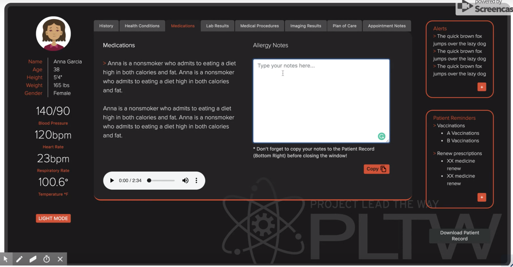

# InternProject
This is an intern project collaborated with designer Jordan Proffitt-Hilbert during summer 2019. 
It's a mocking medical board web application (deigned for ipad size), with tab style navigation, color mode(light & dark).
Built with HTML, CSS, AJAX, JavaScript, jQuery.

Small demo: https://drive.google.com/file/d/1g_aIWGLClYm5geRkIU2tvjjcNalRgsOV/view

Note: No open source allowed due to company confidential reason.
